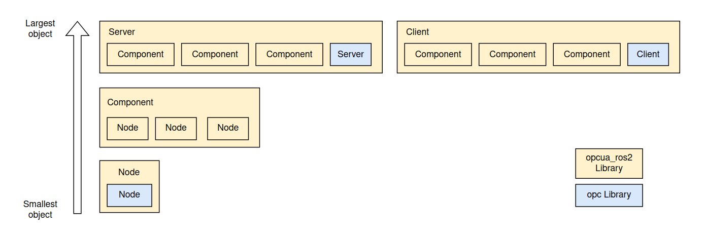
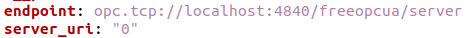
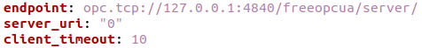
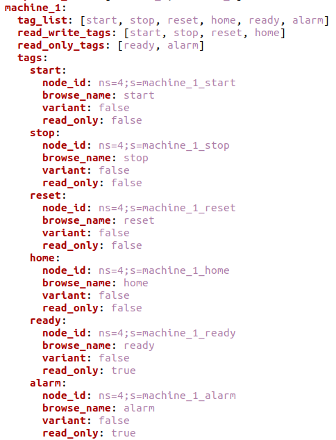

# opcua_ros2 (freeopcua)

C++ implementation of a simple OpcUa server in ROS2, using [freeopcua](https://github.com/FreeOpcUa/freeopcua) as the underlying OpcUa API

This package aims to be a starting ground for implementation of OpcUa interfacing with ROS2.

**Note that the C++ freeopcua [does not include password authentication](https://github.com/FreeOpcUa/freeopcua/issues/194)**

# Repository Packages 

There are 3 main packages available in this repository

| Package | Description |
| --- | --- |
| [freeopcua]() | A custom version of the [freeopcua](https://github.com/FreeOpcUa/freeopcua) github repository. The reason why we are currently including this in the repository because of the [client timeout issue](#client-timeout-issue)  which was not resolved in the main repo branch|
| [opcua_ros2]() | The main ROS2 wrapper around the [freeopcua](https://github.com/FreeOpcUa/freeopcua) library. The only ROS2 functions used in this case is to acquire parameters from a configuration file. Other functionalities like adding of Publisher/subscribers, Service/Action can be easily added to the `opcua_ros2::Server` and `opcua_ros2::Client` class members . |
| [run_opcua_ros2]() | Example implementation of `opcua_ros2` with configuration files mimicking a server-client interaction |


# Working principle

The way the packages are designed is displayed in the layout below.

## Servers and Clients

The largest object in the library is the opcua server and client. this is the main objects that will be interacting with each other via OPCUA. Both Servers and Clients will contain `Components`, and for a server-client interaction, both objects will need to contain the same `Components`.

## Components
A `Component` represents a particular hardware/software component that will be required in the OPC-UA communication. an example of this could be a conveyor belt and a robot connected to the same plc. The conveyor belt can be one `Component`, and the robot will be another `Component`.

## Node
A `Node` represents the component-specific OPC-UA tag that will be monitored/changed.

An example would be a start `Node` and a stop `Node` for the conveyor belt `Component`




# Run the Example

In the built-in example, the client periodically toggles certain tag values of the server. This causes an event change trigger in the server side, printing what tag was changed, and what value. The client-side node also has a separate thread printing the updated values of each tag in the server

## Building
```
mkdir -p ~/colcon_ws/src
cd ~/colcon_ws/src
git clone _____
cd ~/colcon_ws
colcon build 
source install/setup.bash
```
## Running
You will need 2 terminals, one for the server, one for the client

### Server
```
source install/setup.bash
ros2 launch run_opcua_ros2 demo_server.launch.py
```

### Client
```
source install/setup.bash
ros2 launch run_opcua_ros2 demo_client.launch.py
```

## Populating configuration files

For this example, we used 2 main configuration files, one for the server, one for the client. Parameters from these file will be loaded via ROS2 Parameter servers. To see what the entire file looks like, it is located in the `run_opcua_ros2/config` folder

### Server specific configurations



### Client specific configurations



### System specific configurations

It is important for both server and client parameter files' system configuration to be identical to establish a connection

**System Definition**

The parameters here define the various components in the system. Ensure that all components you want to include in your server is added


**Component Definition**
The following is an example of the definition of a `Component` named *machine_1* with the `Node`s *start, stop, reset, home, ready, alarm*



# Caveats
## Client timeout issue

The master branch of freeopcua has [issues with the KeepAlive thread for the client to stop after a certain time.](https://github.com/FreeOpcUa/freeopcua/issues/299)

[A solution was provided in the pull requests](https://github.com/FreeOpcUa/freeopcua/pull/349), which has been currently manually added to a copy of the master freeopcua repo. This custom version is included into this repo.
